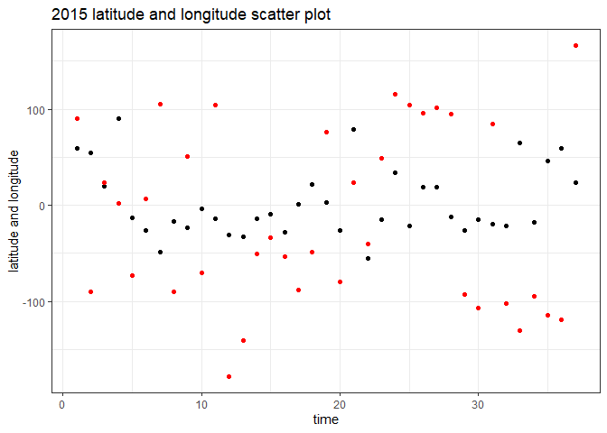
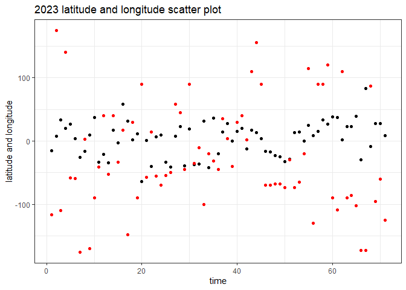
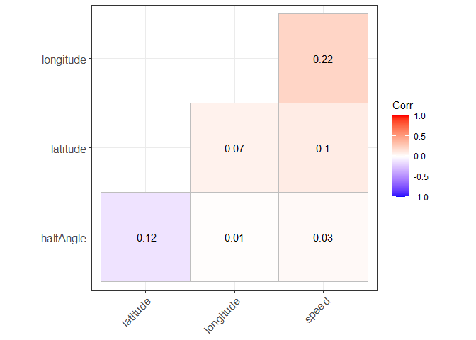
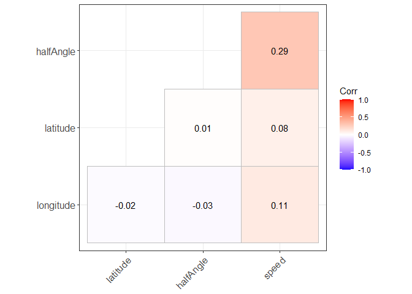
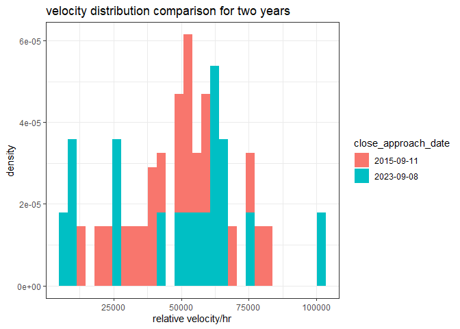
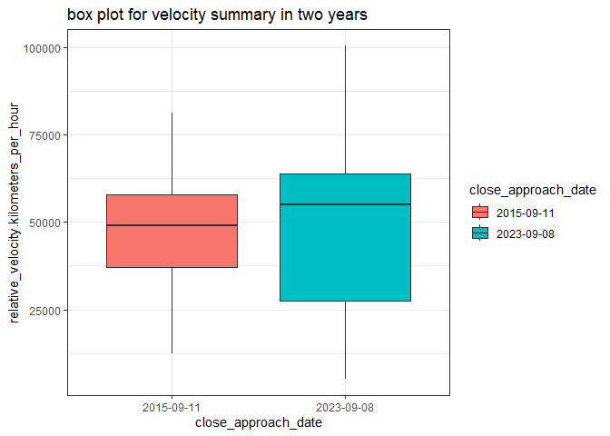
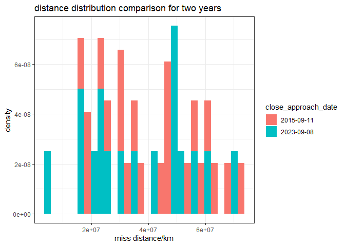
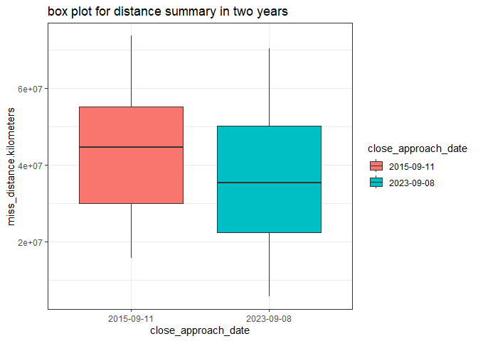

Project2–NASA API
================
Xiaomeng Liu
2023-10-08

- [Goal](#goal)
- [library](#library)
- [setting up Github Repo](#setting-up-github-repo)
- [Vignette Content Details](#vignette-content-details)
  - [endpoint 1](#endpoint-1)
    - [create a function for basic url
      generation](#create-a-function-for-basic-url-generation)
    - [create a function for url with modifications for endpoint 1  
      ](#create-a-function-for-url-with-modifications-for-endpoint-1-)
    - [create a function to draw the final URL from
      API](#create-a-function-to-draw-the-final-url-from-api)
  - [endpoint 2](#endpoint-2)
    - [create a function for basic url
      generation](#create-a-function-for-basic-url-generation-1)
    - [create a function to ineract with the second
      endpoint](#create-a-function-to-ineract-with-the-second-endpoint)
    - [create a function to draw the final URL from
      API](#create-a-function-to-draw-the-final-url-from-api-1)
  - [both endpoint](#both-endpoint)
    - [define the function for all the endpoint and
      mods](#define-the-function-for-all-the-endpoint-and-mods)
    - [test run and first run](#test-run-and-first-run)
    - [second run](#second-run)
- [data evaluation step](#data-evaluation-step)
  - [Question:](#question)
  - [Handling the CME data](#handling-the-cme-data)
    - [numerical summary for CME data](#numerical-summary-for-cme-data)
    - [create scatter plot to see the
      difference](#create-scatter-plot-to-see-the-difference)
    - [draw a correlogram](#draw-a-correlogram)
  - [Handling the asteroids data](#handling-the-asteroids-data)
    - [draw contingency tables](#draw-contingency-tables)
    - [draw histogram and boxplot for data
      analysis](#draw-histogram-and-boxplot-for-data-analysis)
    - [draw histogram and box plot for the distance
      varible](#draw-histogram-and-box-plot-for-the-distance-varible)
- [Conclusion](#conclusion)

# Goal

Our goal with this project is to create a vignette about contacting an
API using functions you’ve created to query, parse, and return
well-structured data. You’ll then use your functions to obtain data from
the API and do some exploratory data analysis. This is an individual
project and your work will be done in a github repo.

# library

Three libraries are included: tidyverse, httr,ggcorrplot and jsonlite

``` r
library(tidyverse) ; library(httr) ; library(jsonlite); library(ggcorrplot) # for correlation plot
```

# setting up Github Repo

I set up my github repo as requested and create a README.md file

# Vignette Content Details

create a vignette for reading and summarizing data from an APIs.  

## endpoint 1

I will build my own functions for querying the API, and return
well-formatted, parsed data.  
The API I chosen is the NASA API with the website
“<a href="https://api.nasa.gov/%22\"
class="uri">https://api.nasa.gov/"\</a>

### create a function for basic url generation

I made this function “pu1” for generating the URL for the endpoint 1 in
the API. An endpoint option is available for user to input their desired
endpoint and the default value will be “CMEAnalysis” as I designed.

``` r
pu1<-function(endpoint="CMEAnalysis"){ 
  ori_url="https://api.nasa.gov/DONKI" #this is the URL for the API necessary for the feed endpoint
  apiurl<-paste(ori_url,endpoint,sep = "/") # paste the URL with the endpoint
  
  # double check the URL
  lastchar<-substr(apiurl,nchar(apiurl),nchar(apiurl))
  if(lastchar=="?"|lastchar=="/"){
    apiurl<-substr(apiurl,1,nchar(apiurl)-1)
  }
  apiurl # output the URL as the result
  }
```

### create a function for url with modifications for endpoint 1 

I made the function mo1_1:mo1_3 to specify the mods user want for the
first endpoint. Then a full URL will be generated at the last one,
mo1_3. Then we will be able to use the URL to get the data we want.  

``` r
# function for mod1
mo1_1<-function(apiurl,mod){ # There are two options for URL and mod specifications
  # the mod 1 is about the start date so we will correct the form
  # the user will only need to input date with "YYYY-MM-DD" format
  dat<-paste0("startDate=",mod) # the mod is full specified. 
  a<-paste(apiurl,dat,sep = "?") # paste this mod with the endpoint to get the desired API. 
  a # output the URL
}
# function for mod2
mo1_2<-function(apiurl,mod){ # same input options 
  # the mod 2 is about the end date so we will correct the form
  # the user will only need to input date with "YYYY-MM-DD" format
  dat<-paste0("endDate=",mod) # the mod is full specified.
  a<-paste(apiurl,dat,sep = "&") # paste this mod with the endpoint to get the desired API.
  a # output the URL
}
# function for mod3
mo1_3<-function(apiurl,mod){ # same input options
  dat<-paste0("mostAccurateOnly=",mod) # this is a true or false option for whether we want the most accurate results only
  a<-paste(apiurl,dat,sep = "&") # paste this mod with the endpoint to get the desired API.
  a<-paste(a,"api_key=yUhdPcxBc0yGQ0IeWdf1DFPHW31gJLtDL8RAiL0b",sep = "&") # since this will be the last mod function, it will paste the key.
  a # output the URL
}
```

### create a function to draw the final URL from API

All the input options will be used in this function, including endpoint,
mod1, mod2, mod3. The default values will be set in this function. It
does two things: generate the URL and pull the data 

``` r
# create a function to draw it from API
da1<-function(endpoint="feed",mod1="latest",mod2="none",mod3="true"){
  a<-pu1(endpoint) # run the pu function for the URL with endpoint1
  # run the mo functions in order to add each modifications to the URL
  a<-mo1_1(apiurl = a, mod = mod1)
  a<-mo1_2(apiurl = a, mod = mod2)
  a<-mo1_3(apiurl = a, mod = mod3) # this will also paste our key to it. 
  outputAPI<-fromJSON(a) # pull the data by "fromJSON" function with the URL
  outputAPI # output the result. 
}
```

I will do a test here to see whether I can get the result I want. By the
test, we can tell the code is working and the output is already a data
frame as desired.

``` r
# do a test
result1<-da1(endpoint = "CMEAnalysis", mod1 = "2016-09-08",mod2 = "2016-10-08",mod3 = "true")
class(result1) # test the class of output
```

    ## [1] "data.frame"

## endpoint 2

This would be similar to the endpoint 1 functions, except we will only
need one mod and the original URL will be different. The “feed” endpoint
will be used for this one.  

### create a function for basic url generation

This is almost the same as the first “pu” function but the original URL
is different and the default option is different.

``` r
# create a function for basic URL generation
pu2<-function(endpoint="feed"){ 
  ori_url="https://api.nasa.gov/neo/rest/v1"
  apiurl<-paste(ori_url,endpoint,sep = "/")
  
  lastchar<-substr(apiurl,nchar(apiurl),nchar(apiurl))
  if(lastchar=="?"|lastchar=="/"){
    apiurl<-substr(apiurl,1,nchar(apiurl)-1)
  }
  apiurl
}
# this function is basically same as "pu1"
```

### create a function to ineract with the second endpoint

This will be the same as the “mo1_1” since both of them are specifying
the start date.  

``` r
# create a function to interact with one mod
mo2<-function(apiurl,mod){
  dat<-paste0("start_date=",mod)
  a<-paste(apiurl,dat,sep = "?")
  a<-paste(a,"api_key=yUhdPcxBc0yGQ0IeWdf1DFPHW31gJLtDL8RAiL0b",sep = "&")
  a
}
# same as previous mo1_1 function
```

### create a function to draw the final URL from API

This will be the same as the “da1” function but I will pick out the data
frame we are interested in.

``` r
# create a function to draw it from API
da2<-function(endpoint="feed",mod="2015-09-08"){ # two default values are set here
  outputAPI<-fromJSON(mo2(pu2(endpoint),mod))
  # same as the previous da1 function
  output<-outputAPI$near_earth_object # specify the data frame we are looking for
  output[[1]] # only keep the first data frame in the list
}
```

Now I did a test here and it works fine with a data frame output.

``` r
# do a test
result2<-da2(endpoint="feed",mod="2015-09-08")
class(result2) # test the class of output
```

    ## [1] "data.frame"

## both endpoint

Now we will start to deal with both endpoints and all the modifications.
A function will be created and it will run twice to get data for later
data evaluation.  

### define the function for all the endpoint and mods

The primary goal here is to combine the previous functions da1 and da2
and output them together.  

``` r
# define the function for all the end point and mods
finalcal<-function(end1="feed",mod1="latest",mod2="none",mod3="true",end2="feed",mod4="2015-09-08"){ 
  # use the default values above. 
  # for end1
  re1<-da1(endpoint = end1, mod1 = mod1, mod2 = mod2, mod3 = mod3)
  # for end2
  re2<-da2(endpoint = end2, mod = mod4)
  # output both data frame in a list
  list(re1,re2)
}
```

### test run and first run

This will be a test run and also the first run of the final function to
get the data from API.  

``` r
# do a test
result3<-finalcal(end1 = "CMEAnalysis", mod1 = "2015-09-08",mod2 = "2015-10-15",mod3 = "true",
                  end2 = "feed", mod4 ="2015-09-08"
                  )
# the output is a list of data frames
```

The function works and outputs a list of data frames.

### second run

The second run is conducted and it also returns a list of data frames to
be used. The data I chose here is having a different year parameter as
the first run so that I could compare them in the next section.  

``` r
# make another call
result4<-finalcal(end1 = "CMEAnalysis", mod1 = "2023-09-08",mod2 = "2023-10-15",mod3 = "true",
                  end2 = "feed", mod4 ="2023-09-08"
                  )
```

# data evaluation step

## Question:

The primary goal of my EDA would be about the differences between 2015
and 2023. There are multiple variables and records I got from NASA API
with both CME analysis and asteroids records. The details could be found
at “<https://api.nasa.gov/>”.  

I will do the EDA for CME data first and then do analysis for the
asteroids records. At the end, I will wrap up what I found from the data
and visualizations.  

This is a brief introduction about the EDA, details are shown below.  

## Handling the CME data

Before do the EDA for CME data, I need to organize the data. Three data
frames are generated, two for 2015 and 2023, one for both.  

``` r
# separate the data frames
# specify a new variable year by mutate()
CME1<-result3[[1]]%>% mutate("year"=2015) # this is CME for 2015
CME2<-result4[[1]]%>% mutate("year"=2023) # this is CME for 2023
# combine the CME data
CME<-rbind(CME1,CME2)
```

### numerical summary for CME data

Some tables are created to show the difference for the latitude

``` r
# interpretate the first endpoint
la1<-CME1%>%
  summarize("year/latitude"="2015",
                      "min"=min(latitude),
                      "max"=max(latitude),
                      "mean"=mean(latitude),
                      "std.dev"=sd(latitude))
la2<-CME2%>%
  summarize("year/latitude"="2023",
                      "min"=min(latitude),
                      "max"=max(latitude),
                      "mean"=mean(latitude),
                      "std.dev"=sd(latitude))
plot1<-rbind(la1,la2)
knitr::kable(plot1,caption = "check the difference for CME latitude between 2015 and 2023",digits = 3)
```

| year/latitude | min | max |  mean | std.dev |
|:--------------|----:|----:|------:|--------:|
| 2015          | -55 |  90 | 2.838 |  36.394 |
| 2023          | -64 |  83 | 3.620 |  27.625 |

check the difference for CME latitude between 2015 and 2023

``` r
# type s
# interpret the first endpoint
la1<-CME1%>%filter(type%in%"S") %>%
  summarize("year/latitude"="2015",
                      "min"=min(latitude),
                      "max"=max(latitude),
                      "mean"=mean(latitude),
                      "std.dev"=sd(latitude))
la2<-CME2%>%filter(type%in%"S")%>%
  summarize("year/latitude"="2023",
                      "min"=min(latitude),
                      "max"=max(latitude),
                      "mean"=mean(latitude),
                      "std.dev"=sd(latitude))
plot1<-rbind(la1,la2)
knitr::kable(plot1,caption = "check the difference for CME latitude between 2015 and 2023 with type S",digits = 3)
```

| year/latitude | min | max |  mean | std.dev |
|:--------------|----:|----:|------:|--------:|
| 2015          | -55 |  90 | 2.435 |  42.275 |
| 2023          | -41 |  58 | 3.975 |  25.275 |

check the difference for CME latitude between 2015 and 2023 with type S

``` r
# type O
# interpretate the first endpoint
la1<-CME1%>%filter(type%in%"O") %>%
  summarize("year/latitude"="2015",
                      "min"=min(latitude),
                      "max"=max(latitude),
                      "mean"=mean(latitude),
                      "std.dev"=sd(latitude))
la2<-CME2%>%filter(type%in%"O")%>%
  summarize("year/latitude"="2023",
                      "min"=min(latitude),
                      "max"=max(latitude),
                      "mean"=mean(latitude),
                      "std.dev"=sd(latitude))
plot1<-rbind(la1,la2)
knitr::kable(plot1,caption = "check the difference for CME latitude between 2015 and 2023 with type O",digits = 3)
```

| year/latitude | min | max |    mean | std.dev |
|:--------------|----:|----:|--------:|--------:|
| 2015          | -23 | -23 | -23.000 |      NA |
| 2023          |   8 |  36 |  17.333 |  11.759 |

check the difference for CME latitude between 2015 and 2023 with type O

``` r
# type C
# interpretate the first endpoint
la1<-CME1%>%filter(type%in%"C") %>%
  summarize("year/latitude"="2015",
                      "min"=min(latitude),
                      "max"=max(latitude),
                      "mean"=mean(latitude),
                      "std.dev"=sd(latitude))
la2<-CME2%>%filter(type%in%"C")%>%
  summarize("year/latitude"="2023",
                      "min"=min(latitude),
                      "max"=max(latitude),
                      "mean"=mean(latitude),
                      "std.dev"=sd(latitude))
plot1<-rbind(la1,la2)
knitr::kable(plot1,caption = "check the difference for CME latitude between 2015 and 2023 with type C",digits = 3)
```

| year/latitude | min | max |   mean | std.dev |
|:--------------|----:|----:|-------:|--------:|
| 2015          | -26 |  59 |  5.538 |  25.165 |
| 2023          | -64 |  83 | -0.240 |  33.109 |

check the difference for CME latitude between 2015 and 2023 with type C

We can tell that generally, the latitude for 2015 is smaller than the
one for 2023. We could see more from other plots. The other plots is
showing that the type O cause the main differences here. It is something
not considered in 2015.  

``` r
# another one for the longitude
la1<-CME1%>%summarize("year/longitude"="2015",
                      "min"=min(longitude),
                      "max"=max(longitude),
                      "mean"=mean(longitude),
                      "std.dev"=sd(longitude))
la2<-CME2%>%summarize("year/longitude"="2023",
                      "min"=min(longitude),
                      "max"=max(longitude),
                      "mean"=mean(longitude),
                      "std.dev"=sd(longitude))
plot1<-rbind(la1,la2)
knitr::kable(plot1,caption = "check the difference for CME longitude between 2015 and 2023",digits = 3)
```

| year/longitude |  min | max |    mean | std.dev |
|:---------------|-----:|----:|--------:|--------:|
| 2015           | -178 | 166 | -13.541 |  92.665 |
| 2023           | -175 | 174 | -24.000 |  84.706 |

check the difference for CME longitude between 2015 and 2023

The difference here is not very clear and not much useful info here, so
I will proceed with the plots.

### create scatter plot to see the difference

The spread for both latitude and longitude is included in these two
plots.

``` r
# change the time variables to a sequence to make it clearer
CME1$time21_5<-seq(1:length(CME1$time21_5))
CME2$time21_5<-seq(1:length(CME2$time21_5))
# the first plot is for the 2015 data
plot4<-ggplot(data = CME1,aes(x=time21_5,y=latitude))
plot4+
  geom_point()+ # scatter plot for the latitude
  geom_point(aes(y=longitude),color="RED")+ # red scatter plot for the longitude
  labs(title = "2015 latitude and longitude scatter plot",x="time",y="latitude and longitude")
```

<!-- -->

``` r
# the second plot is for the 2023 data
# do the same as above
plot5<-ggplot(data = CME2,aes(x=time21_5,y=latitude))
plot5+
  geom_point()+
  geom_point(aes(y=longitude),color="RED")+
  labs(title = "2023 latitude and longitude scatter plot",x="time",y="latitude and longitude")
```

<!-- -->

The x variable time shows all the observations we collect through the
whole year. The most direct thing here is that 2023 is having more
observations than 2015. Also, we could tell that the latitude is having
less variability but the longitude is having more variability.  

### draw a correlogram

A correlogram of all numerical variables is drawn to look for potential
difference.  

``` r
# change the time varaible to more readable
CME$time21_5<-seq(1:length(CME$time21_5))
# draw a correlogram for correlations 
# I found it on this page: https://r-statistics.co/Top50-Ggplot2-Visualizations-MasterList-R-Code.html#Correlogram
corr1<-cor(CME1[2:5])
ggcorrplot(corr1,hc.order = TRUE,
           lab=TRUE,type = "lower",
           ggtheme = theme_bw)
```

<!-- -->

``` r
# draw 2 for comparison
corr2<-cor(CME2[2:5])
ggcorrplot(corr2,hc.order = TRUE,
           lab=TRUE,type = "lower",
           ggtheme = theme_bw)
```

<!-- -->

There some minor differences between correlation for 2015 and 2023. The
correlation between speed and halfAngle is increased and becoming more
significant. Since 2023 has more observation, we might need to collect
more data to prove whether there will be a strong correlation between
them. 2023 is doing better than 2015.Similarly, the corr between
longitude and latitude is getting less significant. If we just look at
one of the data, we may make different decision about whether there is a
correlation.  

## Handling the asteroids data

The asteroids data is organized like the CME data and EDA will be
applied below. The close_approach_data is the data that I would like to
investigate about so I only keep this data frame. The original data
frame contains lists inside so I convert it to data frame for further
analysis.

``` r
# clean the second endpoint
# only keep the close approach data and make it a data frame

# create a function to organize the data. 
dd<-function(x,data){
  x<-data[[2]]$close_approach_data #pull the desired data frame
  x<-data.frame(matrix(unlist(x),nrow=length(x),byrow = TRUE)) # convert the list variables to data frame
  colnames(x)<-c("close_approach_date", "close_approach_date_full", "epoch_date_close_approach", "relative_velocity.kilometers_per_second","relative_velocity.kilometers_per_hour", "relative_velocity.miles_per_hour", "miss_distance.astronomical","miss_distance.lunar", "miss_distance.kilometers", "miss_distance.miles", "orbiting_body")
  x # output the result with correct column names.
}

# apply the function to both data sets from 2015 and 2023.
feed1<-dd(feed1,result3) # data for 2015
feed2<-dd(feed2,result4) # data for 2023
feed<-rbind(feed1,feed2) # data combined

# convert these variables to be numeric for analysis
feed$epoch_date_close_approach<-as.numeric(feed$epoch_date_close_approach)
feed$miss_distance.kilometers<-as.numeric(feed$miss_distance.kilometers)
feed$relative_velocity.kilometers_per_hour<-as.numeric(feed$relative_velocity.kilometers_per_hour)
```

I convert three variables to be numerical for analysis below.

### draw contingency tables

For showing the velocity and distance of the asteroids, I draw some
contingency table introducing it.

``` r
# draw it for velocity
# I would consider everything above overall mean as a high value and others are low values

# specify the col and row names
name1<-c("high","low")
name2<-c("2015","2023")

# velocity
m1<-mean(feed$relative_velocity.kilometers_per_hour)
feed_new<-feed%>%filter(relative_velocity.kilometers_per_hour>m1)
n1<-nrow(feed_new) # count for high value in total
feed_new<-feed_new%>%filter(close_approach_date%in% "2015-09-11")
n2<-nrow(feed_new) # count for high value in 2015
# the difference will be the count in 2023

table1<-rbind(cbind(n2,n1-n2),cbind(nrow(feed1)-n2,nrow(feed2)-n1+n2)) #combine the data as desired
colnames(table1)<-name2 # specify the colnames
rownames(table1)<-name1 # specify the rownames
#output the desired table
knitr::kable(table1,caption = "Velocity--High and low values count for 2015 and 2023")
```

|      | 2015 | 2023 |
|:-----|-----:|-----:|
| high |   11 |   11 |
| low  |   10 |    6 |

Velocity–High and low values count for 2015 and 2023

``` r
# distance
# do the similar things here for distance instead of velocity
  m1<-mean(feed$miss_distance.kilometers)
feed_new<-feed%>%filter(miss_distance.kilometers>m1)
n1<-nrow(feed_new)
feed_new<-feed_new%>%filter(close_approach_date%in% "2015-09-11")
n2<-nrow(feed_new)
table1<-rbind(cbind(n2,n1-n2),cbind(nrow(feed1)-n2,nrow(feed2)-n1+n2))
colnames(table1)<-name2
rownames(table1)<-name1
knitr::kable(table1,caption = "Distance--High and low values count for 2015 and 2023")
```

|      | 2015 | 2023 |
|:-----|-----:|-----:|
| high |   11 |    8 |
| low  |   10 |    9 |

Distance–High and low values count for 2015 and 2023

The results gives a brief understanding of the data, so 2023 data has
less values or obs. Data in 2015 is usually stay closer to the mean
compared with the 2023 for the velocity. The data in 2023 may have a
larger range. The distance ones are similar to each other.

### draw histogram and boxplot for data analysis

For comparing the relative velocity in two years, I draw a histogram and
a box plot for comparison.  

``` r
# draw the plots to show the differences
plot2<-ggplot(feed)
# draw the histogram with density and use year as the color difference
plot2+geom_histogram(aes(x=relative_velocity.kilometers_per_hour,y=..density..,fill=close_approach_date))+
  labs(title = "velocity distribution comparison for two years",x="relative velocity/hr")
```

    ## Warning: The dot-dot notation (`..density..`) was deprecated in ggplot2 3.4.0.
    ## ℹ Please use `after_stat(density)` instead.
    ## This warning is displayed once every 8 hours.
    ## Call `lifecycle::last_lifecycle_warnings()` to see where this warning was generated.

    ## `stat_bin()` using `bins = 30`. Pick better value with `binwidth`.

<!-- -->

``` r
# draw the box plot with velocity distribution and use year as the color difference
plot2+geom_boxplot(aes(x=close_approach_date,y=relative_velocity.kilometers_per_hour,fill=close_approach_date))+
  labs(title = "box plot for velocity summary in two years")
```

<!-- -->

Both plots here are showing that the data for 2023 is covering a wider
range than the one in 2015. There are more data in 2023 and wider range,
but they are centered at similar place.  

### draw histogram and box plot for the distance varible

This is the same as the previous step with the variable changed to
distance.  

``` r
plot3<-ggplot(feed,aes(x=close_approach_date))
# draw the histogram with density and use year as the color difference
plot3+geom_histogram(aes(x=miss_distance.kilometers,y=..density..,fill=close_approach_date))+
  labs(title = "distance distribution comparison for two years",x="miss distance/km")
```

    ## `stat_bin()` using `bins = 30`. Pick better value with `binwidth`.

<!-- -->

``` r
# draw the box plot with distance distribution and use year as the color difference
plot3+geom_boxplot(aes(y=miss_distance.kilometers,fill=close_approach_date))+
  labs(title = "box plot for distance summary in two years")
```

<!-- -->

The plots here is showing different result as the velocity. It shows
that miss distance in 2015 is slightly higher than the one in 2023. Most
of them fit in the same place and the ranges are roughly same.  

# Conclusion

This is the last part of this project. Based on the graph and plots
generated above, the difference between 2015 and 2023 exists. It shows
that there are some improvement on the CME data collection so the new
data is wider and covering more possible values in the universe. The
asteroids data is showing less difference since all the asteroids are in
the sky. The development is not showing much difference for the
observations, but the accuracy of the observation is increased since our
miss distance is decreased.

This proves that our 2023 data is generally better than the previous
data and NASA’s development is influencing our analysis about the
universe but there is not a big gap on the things we found. I tried to
save as much data as possible before the evaluation step in case anyone
might do more analysis with it.

Thanks for reading this.
